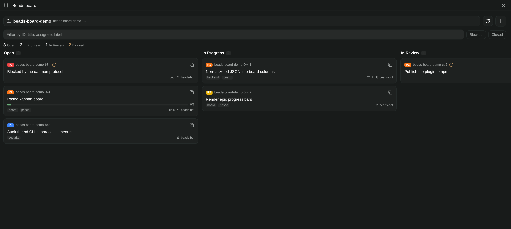
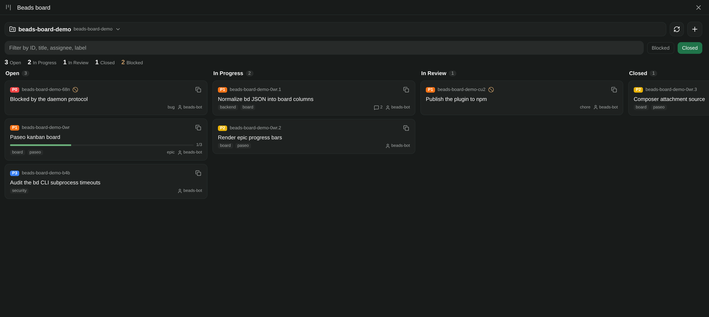
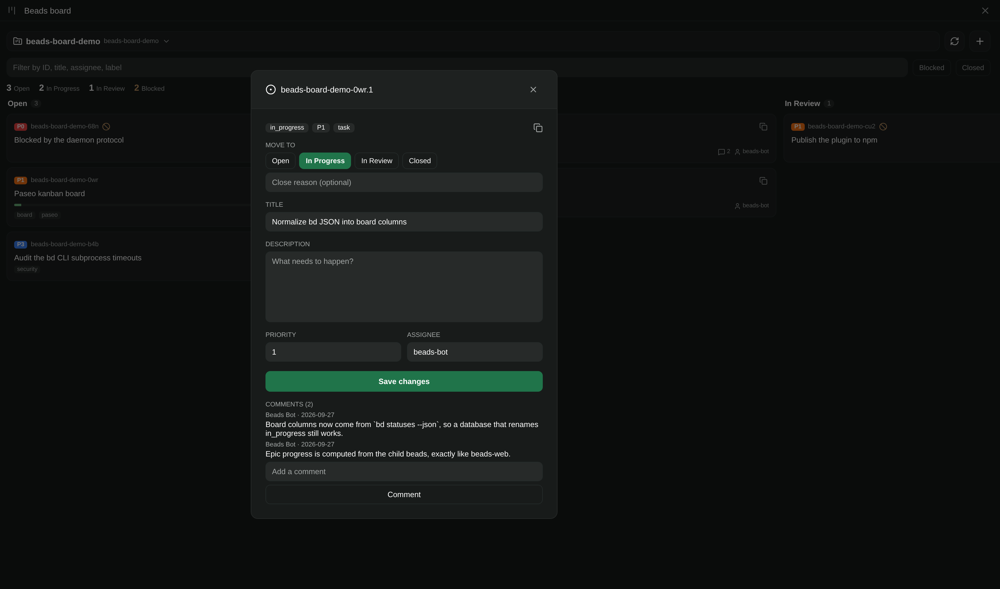
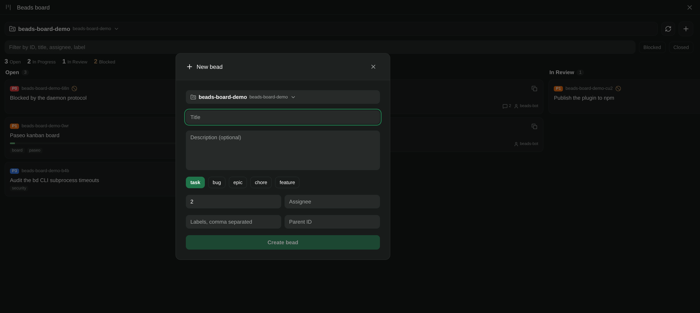

# Beads board for Paseo

A Paseo plugin that turns the [beads](https://github.com/steveyegian/beads) `bd` CLI into a
kanban board inside Paseo, inspired by [beads-web](https://github.com/weselow/beads-web).

> **Pre-1.0.** Releases are `0.x`, following semver's pre-1.0 convention: features and fixes bump
> the patch version, but a minor bump may still contain breaking changes until the plugin API and
> the board settle at `1.0.0`. Pin an exact version if you do not want to track the latest release.

The board is rendered by the Paseo app (React Native, so desktop, browser, iOS, and Android all
work) and every data operation runs the `bd` CLI in a subprocess on the daemon host. Install the
plugin on each host you want a board for; Paseo shows one sidebar item with a host picker and the
selected host serves its own projects.

## Screenshots



<details>
<summary>More screenshots</summary>







</details>

## Features

- **Project discovery** — scans Paseo projects and workspaces on the host for an initialized beads
  database, plus any extra paths you add in settings. Worktrees that share a database are collapsed
  onto it, so each project is listed once.
- **Kanban board** — Open / In Progress / In Review / Closed, with the same status mapping as
  beads-web (`blocked`, `deferred`, `pinned` show as badges on Open; `hooked` shows on In
  Progress; `tombstone` is hidden).
- **Epics** — child beads are grouped under their parent with a progress bar, like beads-web.
- **Blocked detection** — a bead is blocked when an unresolved dependency is still open, or its
  status is `blocked`.
- **Mutations** — create beads (with a project dropdown covering every discovered beads database),
  move them between columns, edit title/description/notes/priority/assignee, close and reopen, and
  add comments. Each mutation shells out to `bd`.
- **Bead detail** — full text (`bd show`), relations, and comments (`bd comments`).
- **Workspace panel** — the same board as a workspace tab, preselected to the workspace's project.
- **Composer attachment source** — attach a bead to a prompt from any composer.
- **Host settings** — extra project paths, refresh interval, closed-column default.

## Requirements

- Paseo 0.8.0 or newer, on the daemon host and the connected app.
- The [beads](https://github.com/steveyegian/beads) `bd` CLI on the **daemon host's `PATH`**, so the
  plugin can shell out to it. Set `PASEO_BEADS_BD_BIN` in the daemon environment if the binary
  lives somewhere unusual.

Plugins are trusted, unsandboxed code. This plugin's server code runs `bd` in the daemon user's
account, so it can read and change the beads databases that user can reach. Review the source
before installing it on a machine you care about.

## Install

Paseo 0.9 and newer install from npm:

```bash
paseo plugin install npm:paseo-beads-board
```

Pin a specific release when you do not want to track the latest one:

```bash
paseo plugin install npm:paseo-beads-board@0.1.0
```

Paseo 0.8 installs from the repository:

```bash
paseo plugin add jmkelly/paseo-beads-board
```

The daemon must have plugins enabled. Check with `paseo daemon status --json`; the file is
`<home>/config.json` and needs a root `"pluginsEnabled": true`, followed by `paseo reload`.

From a clone of this repository:

```bash
npm install
npm run typecheck
npm test
paseo plugin install /absolute/path/to/paseo-beads-board
paseo plugin ls
paseo plugin logs beads-board
```

Source changes need `paseo plugin reload beads-board`. After installing, open **Beads board** in
the sidebar, pick a project, and the board appears.

## Using the board

- **Move a bead** — open it and use the status buttons in the detail sheet. There is no drag and
  drop (see [Limitations](#limitations)).
- **Create a bead** — the *New bead* button on the board; the project dropdown lists every
  discovered beads database.
- **Add a bead to a prompt** — type in the composer and pick the **Beads** attachment source, then
  search by id or title.
- **Per-host preferences** — **Settings → Beads board** controls extra project paths, the refresh
  interval, and whether the Closed column is shown. Preferences are host-scoped and shared by every
  client connected to that daemon.

## Layout

```text
paseo-plugin.json     plugin id, description, supported Paseo versions
index.client.tsx      surface, sidebar item, workspace panel, settings screen, commands, attachment source
index.server.ts       RPC handlers + host settings registration
shared/beads.ts       Zod contracts, RPC definitions, status -> column mapping
shared/settings.ts    host-scoped preferences document
shared/attachments.ts composer attachment source
server/bd.ts          `bd` process execution helpers
server/beads.ts       raw bd JSON -> board normalization (parents, blockers, epic progress)
server/handlers.ts    project discovery and every RPC handler
client/hooks.ts       TanStack Query hooks and mutations
client/board/         board screen, columns, cards, detail/create/picker modals
tests/                unit tests for the status mapping and board normalization
```

## RPCs

| RPC              | Runs                                    |
| ---------------- | --------------------------------------- |
| `beads.projects` | `bd status --json`, `bd count --json --status inreview`, `bd where --json` |
| `beads.board`    | `bd list`, `bd statuses --json`, `bd where --json` |
| `beads.show`     | `bd show <id> --json`, `bd comments <id> --json` |
| `beads.create`   | `bd create --json`                      |
| `beads.update`   | `bd update` / `bd close` / `bd reopen`  |
| `beads.comment`  | `bd comment`                            |
| `beads.search`   | `bd list --json --brief --all`          |

Discovery uses the daemon's Paseo API (`projects.list()`, `workspaces.list()`) to find candidate
directories, and a directory appears on the board when `.beads` holds an initialized database
(`config.yaml`, `metadata.json`, or `issues.db`) — directly, or within four parent levels. Each
database is listed once however many Paseo worktrees point at it, and the counts come from `bd`'s
own `status` summary rather than a full issue list.

## Development

```bash
npm install
npm run typecheck
npm test
paseo plugin install /absolute/path/to/paseo-beads-board
paseo plugin reload beads-board
```

Keep the plugin ID (`beads-board`) and the npm version in `package.json` in step: Paseo 0.9
installs the npm package, and the paseo.cafe catalog uses the published version as the plugin's
update identity, so every release needs a version bump and an `npm publish`. While the plugin is
pre-1.0, bump with `npm version patch` for fixes and `npm version minor` for anything that may
change existing behaviour.

## Limitations

- This plugin is pre-1.0 (`0.x`). A minor version bump may contain breaking changes, so pin a
  version if you are depending on today's behaviour.
- The `bd` CLI must be installed on each daemon host you install this plugin on; a missing binary
  surfaces as an error on the board and in `paseo plugin logs beads-board`.
- No drag and drop. React Native plugin code has no gesture-handler dependency, so cards move
  through the status buttons in the detail sheet.
- No GitOps, PR, memory, or worktree panels: this plugin covers the beads board itself, unlike
  beads-web.
- Beads are always read with `bd list --brief`; long text is fetched on demand with `bd show`, so
  very large boards briefly load in two passes.
- Board data is capped at 5000 beads per load; larger databases show a truncated board.
- Status names come from each database (`bd statuses --json`), so a database that has renamed
  `in_progress` will move beads to whatever status currently maps to that column.

## Contributing

Issues and pull requests are welcome at
<https://github.com/jmkelly/paseo-beads-board/issues>. Please run `npm run typecheck` and
`npm test` before opening a pull request.

## License

[MIT](./LICENSE)
